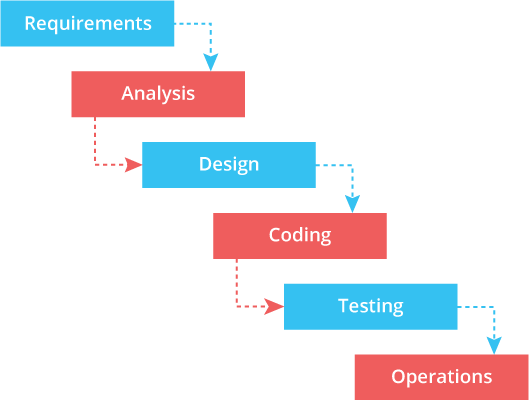

# 애자일 이여야 하는가❓

애자일은 소프트웨어 엔지니어링 다른 말로 소프트웨어 공학이라 불리는 학문의 일부분으로 **소프트웨어(프로젝트)의 개발, 운영, 유지보수 등의 생명 주기 동안 효율적으로 업무를 하는 방식(방법론)입니다.**

  
애자일은 소프트웨어 엔지니어링에 만 국한 된 것이 아니라 다양한 분야에서 적용하고자 시도를 하고 있습니다.

애자일 방법론은 소프트웨어 개발 방법에 있어서 아무런 계획이 없는 개발 방법과 계획이 지나치게 많은 개발 방법들 사이에서 타협점을 찾고자 하는 방법론 입니다.

계획이 없는 방법론의 경우, 앞으로의 일을 예측하기 힘들고 효율적 이지 못하다는 점에서 취약점을 가지고 있으며, 계획에 너무 의존하는 경우는 그 형식적인 절차를 따르는데 필요한 시간과 비용을 무시할 수 없으며, 전체적인 개발의 흐름 자체를 느리게 하는 단점이 있습니다.

즉, **애자일은 효율적이고 유연한 방식으로 목표에 달성 할 수 있도록 하는 업무 방식을 목표**로 하기 때문에 요새 많은 기업들이 문화로 도입하고자 노력중 입니다.

그럼, 전통적인? 개발 프로세스와 애자일 개발 프로세스에 대해 좀 더 알아 보겠습니다.

---

## 폭포수 모델(Waterfall model)

폭포수 모델은 전통적인 개발 방법론으로  
**요구 분석 → 기획 → 디자인 → 개발 → 테스트 → 출시**  
위 순서대로 진행하여 마치 폭포가 떨어지는 식으로 순차적인 단계를 밟는다고 하여 폭포수 방식 이라고 불립니다.

워터폴 방식으로 프로젝트를 진행하다 보니 요구 분석, 기획 단계에서 진행한 일련의 과정들이 고객의 요구를 100% 충족하는 경우가 거의 없는 문제가 발생하고 기획 변경 시 개발 대응이 쉽게 이루어 지지 않는 문제들이 발생 합니다.

  
요구 분석을 정확히 하지 못하여 기획이 변경될 경우 개발자들은 수정을 해야 되는 이슈 발생 하며, 요구 분석 → 기획 → 디자인 → 개발로 이어지는 흐름을 반복적으로 기다려야 합니다.

이런 이슈들이 처리되지 않은 채로 엉키게 되면 **코드 품질은 떨어지고 요구사항은 모두 충족되지 않은 상태의 결과물**이 만들어 지며, 시간은 자꾸 미뤄지고 그러면서도 모두가 힘들 상황에 빠지게 됩니다.

저 같은 경우 위 처럼 안좋은 경험만 있었던 것도 아니지만 대부분 요구 분석이 정확하게 이루어 지지 못하고 협의가 안될 경우는 위의 경험을 했습니다.

---

## 애자일(Agile)

애자일은 요구 사항들을 민첩하고 기민하게 충족시켜 개발하자는 방법론 입니다.

요구 분석, 기획 등 전체 프로젝트에 대한 모든 문서를 만들고 해당 작업들이 모드 끝난 이후 개발에 들어가던 워터폴 방식과는 달리 애자일은 기능 단위의 프로토타입을 기반으로 일합니다.

  
**좀 더 작은 단위로 개발을 해서 해당 부분을 직접 고객에게 선보이고 피드백을 빠르게 전달받아 수정이나 이슈 처리에 대한 기민한 대응을 하자는 것 입니다.**  
여기서 한가지 주의할 점은 좀 더 작은 단위의 개발을 한다고 해서 퍼즐 처럼 조각 조각 내서 개발 후 하나로 합치는 것이 아닌 **완벽하지는 않지만 고객의 요구사항을 증명 할 수 있는 개발을 하여 대한 피드백을 받고 요구사항을 반영하는 것 입니다.**

종류: XP, 스크럼, 칸반에 대한 설명(종류별)  
**스크럼과 칸반은 애자일이라는 방법론을 실현하는 도구의 역할**입니다.

스크럼은 스프린트를 기반으로 애자일 방법론을 실행하고, 칸반은 Work In Process를 제안하여 애자일 방법론을 실행합니다.

---

## 스크럼(scrum) 이란?

스크럼은 5~9명으로 구성되는 소규모의 다기능 팀이 제품 개발을 완성하기 위해 **스프린트(sprint)라고 불리우는 업무 주기를 반복**합니다.

이 팀은 제품 책임자(PO:Product Owner)가 관리하는 "해야 할 일들의 목록(product backlog)"에서 "스프린트 동안 해야 하는 일들(sprint backlog)"을 스스로 결정하고 완수하여 매 스프린트 마다 결과물(increment)을 산출 해냅니다.

팀이 성과를 낼 수 있도록 조력하는 역할을 스크럼 마스터(scrum master)라고 하는데, 그는 팀이 과제를 완수할 수 있도록 필요한 자원을 지원하거나 장애 요소를 제거하며 프로세스를 인도하는 역할입니다.

---

## 칸반 이란?

칸반은 연속적 흐름 처리 방식입니다. 이슈는 큐에 입력되고, 개발 프로세스의 단계에 따라 당겨 집니다.

칸반은 **칸반 보드로 시각화**되고 각각 **단계는 열**로 표시합니다.

  
**이슈들은 "수영 레인(SwimLane)"으로 불리는 행**으로 나누고 **우선순위가 낮은 이슈들을 아래에 배치합니다**. **칸반의 핵심은 Work-In-Process(WIP)가 동시에 개발이 진행 될 수 있는 아이템의 수를 제한**하는 것이며, 작업자는 WIP에 여유가 있을 때 만 작업을 왼쪽에서 오른쪽으로 당길 수 있습니다.

  
스크럼이 스프린트에 이용할 수 있는 작업 시간을 제한함으로써 생산성을 제어하는 반면, 칸반은 **동시에 처리할 수 있는 이슈의 수를 제한함**으로써 생산성과 속도(velocity)를 제어합니다.

**칸반의 핵심은  
Work-In-Process(WIP)를 제한 하자 입니다.  
TO-DO의 행에 이슈를 우선순위에 따라 나열하고 작업자는 우선 순위대로 이슈를 처리합니다.  
한번 이슈에 처리를 시작하면 해당 이슈를 끝낸 후 다음 이슈를 확인 하고 업무에 들어 갑니다.  
(멀티 테스킹을 그만둬라 !!! 라고 하네요...)**

---

## 애자일 프로세스 적용을 필요로 하는 조직은 어느 조직 일까 ❓

- **목표 달성을 위한 프로세스를 가지지 않고, 임기응변 적인 소프트웨어 개발로 인해 혼란에 빠져있는 조직**  
애자일 개발 프로세스는 작고 쉽게 도입할 수 있으며, 상대적으로 비용도 적기 때문에 이러한 조직에는 개선을 위한 좋은 방법이 될 수 있습니다.
    
- **전통적인 프로세스를 도입하고 있지만 제대로 동작하지 않는 조직**  
업무 수행에 있어 사전에 이루어 져야 하는 업무가 발생하고, 그로 인해 업무에 부담을 느끼고 있는 조직에 문화 개선에 좋은 결과를 가져다 줄 수 있습니다.
    

마지막으로 애자일 프로세스 도입을 성공적으로 적용하기 위해서는 많은 노력이 필요합니다.  
무엇이든 변화하기 위해서는**기존 방식 및 문제점을 정확히 인지**해야 하고, 이를 바탕으로**구성원들이 명확한 목표 의식을 공유**할 필요가 있습니다. 기업과 실무진 사이의 괴리감을 줄이기 위해서는 **애자일에 대해 파악하기 전에 기존의 프로세스를 단계별로 정의하는 노력을 먼저** 기울여야 합니다.

더 좋은 조직 문화를 위해 모두가 의견을 조율 해가며 적극적으로 동참하면 좋은 결과를 가져다 줄 것입니다.  
아래 블로그에 정리가 잘 되어 있으니 한번 꼭 확인 해주세요.🤙 (제 블로그는 아닙니다.)

---

## 그렇다면, 우리 부서는 어느 기반으로 애자일 방법론을 사용해야 할까?

주로, **프로젝트 같은 종료 일이 정해져야 하는 업무가 많이 발생하는 경우는 스크럼**,  
**지속적인 업무를 다루며 프로젝트 개발 및 ops까지 함께 다뤄야 하는 상대적으로 작은 단위의 팀에서는 칸반**을 사용하는 것이 효율적 입니다.

## Hotfix 라는 이슈를 다루는 관점에 대한 스크럼과 칸반의 차이

HotFix란 말 그대로 **예측되지 않았던 요청**입니다.

운영되고 있는 서비스라면 고객이 마주친 버그 일 수도 있고, PO가 계획 당시에는 미처 정의하지 못했던 급한 business requirement 일 수 있습니다.

**스크럼 에서는 Hotfix는 해당 스프린트에 “절대” 넣지 않습니다.**  
스프린트 진행 중 발생하는 모든 Hotfix는 무조건 다음 스프린트의 백 로그로 쌓이게 되고 다음의 업무가 됩니다. (운영 중인 서비스라면 개발자가 돌아가며 운영 업무를 맡기도 합니다)

**칸반 에서는 Hotfix 또한 바로 프로젝트 backlog에 쌓습니다.**  
반대로 칸반은 쌓여진 Hotfix를 바로바로 처리할 수 있습니다. 해당 프로젝트를 끝내기 위해 처리해야 할 이슈 카드로 동일하게 취급합니다.

## 참고

> [Manifesto for Agile Software Development](http://agilemanifesto.org/iso/en/manifesto.html)  
> [애자일 선언 이면의 원칙](http://agilemanifesto.org/iso/ko/principles.html)  
> [[번역] 잘 가요 스크럼, 반가워요 칸반](https://medium.com/@pitzcarraldo/%EB%B2%88%EC%97%AD-%EC%9E%98-%EA%B0%80%EC%9A%94-%EC%8A%A4%ED%81%AC%EB%9F%BC-%EB%B0%98%EA%B0%80%EC%9B%8C%EC%9A%94-%EC%B9%B8%EB%B0%98-e27d1db15699)  
> [애자일과 워터폴, 그리고 애자일의 친구들 스크럼과 칸반](https://medium.com/@unini/%EC%95%A0%EC%9E%90%EC%9D%BC%EA%B3%BC-%EC%9B%8C%ED%84%B0%ED%8F%B4-%EA%B7%B8%EB%A6%AC%EA%B3%A0-%EC%95%A0%EC%9E%90%EC%9D%BC%EC%9D%98-%EC%B9%9C%EA%B5%AC%EB%93%A4-%EC%8A%A4%ED%81%AC%EB%9F%BC%EA%B3%BC-%EC%B9%B8%EB%B0%98-d53c23aadd57)  
> [우리는 왜 애자일을 적용하지 못하는가?](https://brunch.co.kr/@fits-b/1)