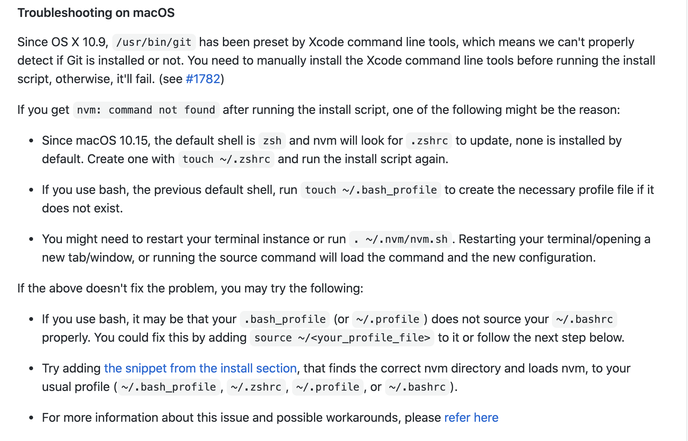

# Node.js 버전 관리 하기(nvm)

새로운 랩탑에 Node.js를 설치해야 될 상황이 생겼다.  
기존의 서비스들을 운영하면서 노드 버전으로 고생한 기억이 있어서 NVM을 설치하여 사용하기로 했다.

## Node Version Manager(NVM) ? 
node.js의 버전 관리자... 더이상의 설명은 필요가 없습니다... 영어가 딸려서 😅  
아래 깃헙에서 설치도... 다 친절하게 설명한다.  
> [Git hub](https://github.com/nvm-sh/nvm)

## mac install (brew)
필자는 ``` brew ```를 사용하여 설치 하였다.  

```bash
brew install nvm 
```

하다가 nvm 설치시 오류가... ``` nvm: command not found ``` 발생   
확인 결과 OS X 10.15 이상부터 zsh shell을 기본으로 사용하기 때문에 발생하는 불라불라 한다. 😂  



```bash
export NVM_DIR=~/.nvm
source $(brew --prefix nvm)/nvm.sh
```

**위 참조를 ~/.zshrc** 하단에 작성 후 저장 및 종료 후 사용

혹시 안되시는 분은 ``` source ~/.zshre ``` 하신 후 해당 커맨드 종료 후 재시작 해보세요~ 🥳

``` nvm ``` 명령어에 대한 설명이 잘 나오시면 성공입니다.

## node 설치 및 사용 방법

우선 최신 버전을 설치하여 사용해보겠습니다.
설치 하고 보니 현재 기준 v14.15.0이 LTS버전 이여서 추가 설치... 했네요... 😟 😎

```bash
nvm install node # 필요버전이 있으시면 입력 하시면 되고 없으면 최신으로 설치 됩니다.

nvm use node # 사용하고자 하는 node 버전으로 변경 합니다.

nvm ls # 현재 설치되어 있는 node의 버전들을 확인 합니다.

nvm alias default system # 현재 사용중인 노드 버전을 시스템 기본으로 사용 합니다.

which node # 현재 기본 설정으로 되어 있는 노드 버전을 확인합니다.
```
