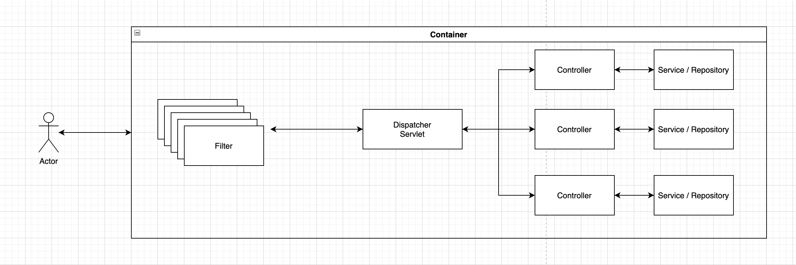

# 00) Spring Security

Created: Apr 8, 2021 6:40 PM
Tags: Security, Spring

# 스프링 시큐리티 구조

> 스프링 시큐리티.. 인증과 인가(권한)를 담당한다. 
그래서 어떻게 담당하느냐 ? Filter를 통해 기본 구성을 활성화 하고, FIlterChain통해 어플리케이션 내의 보안을 담당한다.🧐

저같은 개발자는 보안이라는 단어는 너무도 어렵게 느껴지고, 어떤 원리로 잘 알지 못하는 작업들을 수행 하고 할 수 있는가... 알아 보려고 합니다.
사용하고 공부하고 알아가는 것들을 글로 남기지 않으면 제 머리는 다 잊는 이슈가 있어서...

**잘못된 정보가 있으면 알려주세요 😅**

먼저 시큐리티를 설명하기에 앞서 서블릿 컨테이너 기반의 어플리케이션의 구조를 잠시 보고 넘어가겠습니다.

### 서블릿 컨테이너(Servlet Container) 구조

> 서블릿 컨테이너(톰캣)으로 웹 어플리케이션을 구성하면 아래와 같은 라이프사이클을 가지고 사용자의 요청에 대한 응답을 전달합니다.
DispatcherServlet으로 요청이 오기전에 우리는 Filter들을 구성할 수 있고 그 필터들을 통해서 서블릿 요청 전처리 후처리를 할 수 있습니다.

필터들을 추가로 구성하여 chaining을 할 수 있는점을 기억하세요.

### 서블릿 컨터에너에서 동작하는 스프링 시큐리티 구조

> 스프링 시큐리티는 자신들의 Filter들을 chaing하여 동작시키기 위해 DelegatingFilterProxy를 이용합니다. 이 필터를 이용해서 서블릿 컨테이너와 스프링 컨테이너 사이에서 동작합니다. 해당 필터를 통해 Spring의 어플리케이션 컨텍스트에서 얻은 Filter Bean을 대신 실행하게 됩니다.  DelegatingFilterProxy는 서블릿 필터체인에서 시큐리티만의 필터 체인을 실행 시키게 됩니다.

시큐리티 필터 체인은 최소 1개를 구성해야하며 URL 패턴을 이용하여 별도의 필터 체인을 사용할 수 있습니다.

> Documents

[Spring Security Reference](https://docs.spring.io/spring-security/site/docs/current/reference/html5/#servlet-architecture)